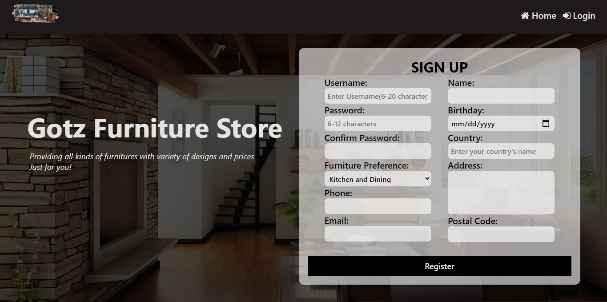
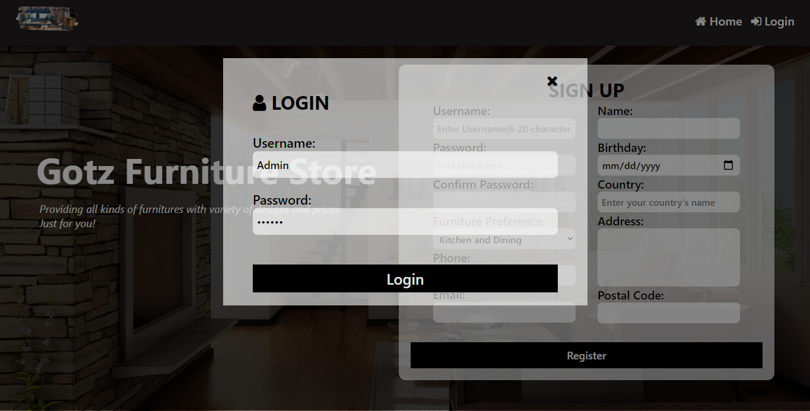
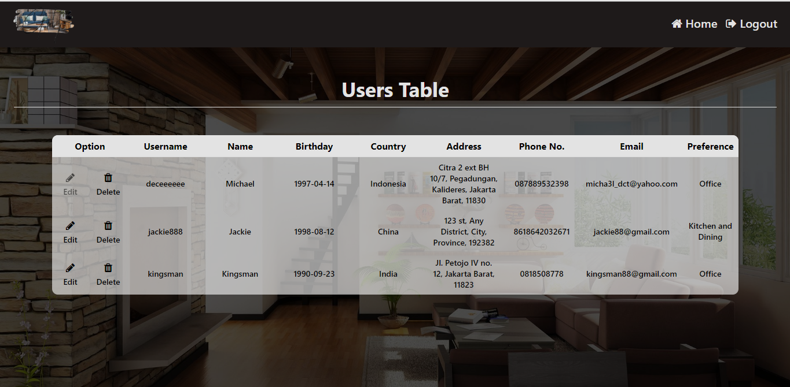
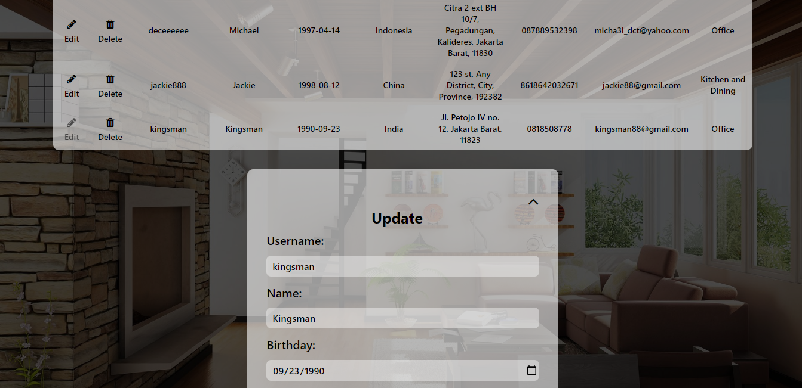

# Landing Page

This project is initiated because of the test case given by one company for the technical test. In this project, I chose my Furniture Store Website project as the content for the landing page. This landing page is quite responsive and friendly to most mobile devices.

## Tools and Softwares

**Programming Language: PHP, Javascript, HTML, CSS, MySQL**

**Software: Visual Studio Code, XAMPP**

**Libraries: Font-awesome w3schools, Ajax/jQuery**

## Features

### 1. Landing Page

The landing page has registration form so that once the user get into this page, there will be a higher chance that they will register an account for this website if they are interested in furniture. This is called CTA(Call To Action).

The registration form also has data validation which makes sure that the correct data will be input. For example, phone number and postal code should be numbers. Once the user try to input a letter in the text input, the text input will be cleared by itself, rejecting letters input.

### 2. Login Modal Box

If the user click login on the top-right of the page, this login form will show up. Then user can log into the website with the account they have created.

### 3. User Table

After logging in, user can see the user table and all the data that they have registered. From here, user can also update or delete the user in the table.

.png>)
